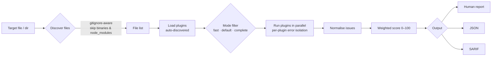
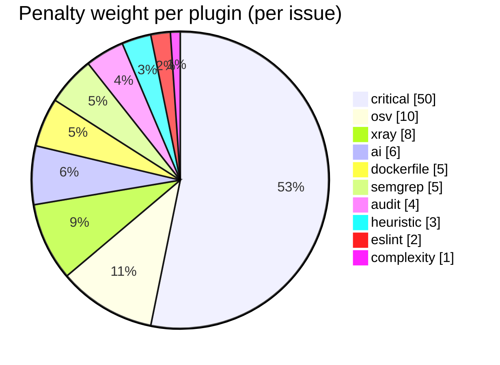
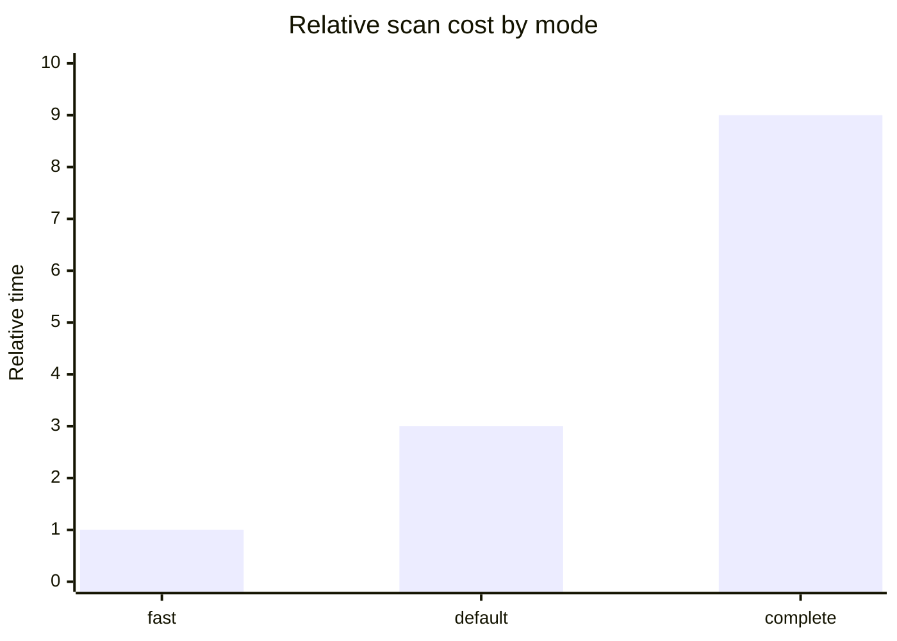

<div align="center">


# 🥕 harvest-clo

**Fast, plugin-driven security & code-quality scanner — one command, one score.**

Scan your code for security risks and quality issues with a suite of composable plugins, get a single **0–100 score** and letter **grade**, with actionable file-and-line feedback. Runs locally, in CI, and in your editor.

[](https://github.com/Aditya060806/Harvest/actions/workflows/ci.yml)
[](https://www.npmjs.com/package/harvest-clo)
[](https://www.npmjs.com/package/harvest-clo)
[](LICENSE)
[](https://www.npmjs.com/package/harvest-clo)

[Quick start](#-quick-start) · [How it works](#-how-it-works) · [Comparison](#-how-harvest-compares) · [Scoring](#-scoring-model) · [Performance](#-performance--efficiency) · [CLI](#-cli-reference) · [CI](#-github-action)

</div>

---

```console
$ npx harvest-clo src/

  B+  87/100  ███████████████████░░░░░  good
  0 error  4 warning  0 info  · 4 total · 210ms

  src/payments.js
     WARN   42:10  Use of eval()  (heuristic)
     WARN   7:3    Possible hard-coded credential  (heuristic)

  ▲ +5 since last run (was 82)
```

## ✨ Highlights

| | |
| --- | --- |
| 🎯 **One number to watch** | Every scan yields a single score + grade, so quality is trivial to track over time. |
| ⚡ **Fast & parallel** | Plugins run concurrently with per-file content caching; binaries and huge files are skipped. |
| 🔌 **10 plugins built in** | Critical patterns, heuristics, ESLint, complexity, AST security, Semgrep, `npm audit`, OSV CVEs, Dockerfile, NLP. |
| 🧩 **Auto-discovered plugins** | Drop a file in `plugins/` (or `harvest plugin create`) — it's picked up automatically. |
| 🛠️ **Autofix** | `--fix` applies safe ESLint fixes before scanning. |
| 🧾 **SARIF + JSON** | Findings show up inline on GitHub PRs; JSON for any tooling. |
| 🪜 **Baseline / ratchet** | Adopt on legacy code and fail CI only on *new* issues. |
| 🤖 **CI-native** | Real exit codes and a ready-made GitHub Action. |
| 🧰 **Zero config** | Useful the moment you run it — a config file is optional. |

## 🚀 Quick start

```bash
# Try it instantly, no install
npx harvest-clo .

# Or install globally (command is `harvest`)
npm install -g harvest-clo
harvest .
```

```bash
harvest -f                       # fast scan
harvest src/ -c                  # complete scan
harvest . --fix                  # autofix, then scan
harvest . --sarif -o harvest.sarif
harvest . --json > report.json
```

## 🧠 How it works

Harvest is a small orchestrator around a set of independent plugins. Each plugin decides which files it `applies` to and returns structured issues; the engine isolates failures, aggregates issues, and computes a weighted score.



**Design principles**

- **Isolation** — a plugin that throws (parse error, missing tool, API drift) never aborts the scan.
- **Determinism** — the same input yields the same score; results are consistent across CLI, API, and editor.
- **Bounded work** — files over 512 KB and known binary types are skipped; content is read once and cached.
- **Extensibility** — plugins are auto-loaded from the plugins directory, so adding checks needs no wiring.

## 📊 How Harvest compares

Harvest bundles many single-purpose tools behind one score. This is a **capability matrix** — a map of what each category typically covers, not a performance benchmark.

| Capability | Harvest | ESLint | `npm audit` | Semgrep | Snyk |
| --- | :---: | :---: | :---: | :---: | :---: |
| Single 0–100 score + grade | ✅ | ➖ | ➖ | ➖ | ✅ |
| Lint / style | ✅ (via ESLint) | ✅ | ➖ | ➖ | ➖ |
| Cyclomatic complexity | ✅ | ➖ | ➖ | ➖ | ➖ |
| AST security (js-x-ray) | ✅ | ➖ | ➖ | ✅ | ✅ |
| Pattern rules (OWASP) | ✅ (Semgrep) | ➖ | ➖ | ✅ | ✅ |
| Dependency CVEs | ✅ (audit + OSV) | ➖ | ✅ | ➖ | ✅ |
| Dockerfile checks | ✅ | ➖ | ➖ | ✅ | ✅ |
| SARIF output | ✅ | ✅ | ➖ | ✅ | ✅ |
| Baseline / ratchet | ✅ | ➖ | ➖ | ✅ | ✅ |
| Autofix | ✅ (ESLint) | ✅ | ➖ | ➖ | ➖ |
| Runs fully offline | ✅¹ | ✅ | ➖ | ✅ | ➖ |
| Zero-config default | ✅ | ➖ | ✅ | ➖ | ➖ |
| Free & MIT | ✅ | ✅ | ✅ | ✅² | ➖ |

<sub>¹ Offline in `fast`/`default` mode; `complete` mode uses the network for `osv` (CVE lookup) and optionally `semgrep`. ² Semgrep OSS is free; some rulesets/features are commercial.</sub>

## 🎯 Scoring model

The score starts at 100 and subtracts a weight per issue. A single **critical** finding fails the scan outright (score 0).



| Score | Rating | Grade | Exit code |
| --- | --- | --- | :---: |
| 90–100 | excellent | A+ / A / A- | 0 |
| 75–89 | good | B+ / B / B- | 0 |
| 50–74 | fair | C+ / C | 0 |
| 25–49 | poor | D | 1 |
| 0–24 | bad | F | 2 |

Weights and thresholds are fully overridable in `harvest.config.js`.

## ⚡ Performance & efficiency

Harvest is built to stay fast as repositories grow:

- **Parallel plugins** — all active plugins run concurrently (`Promise.all`), not one after another.
- **Read-once caching** — each file's contents are read a single time and shared across plugins.
- **Smart discovery** — `.gitignore`-aware, and `node_modules`, `dist`, `out`, `build`, `coverage` are excluded.
- **Binary & size guards** — known binary extensions and files > 512 KB are skipped before any regex runs.
- **Incremental mode** — `--incremental` scans only files changed vs git `HEAD`.

**Relative cost by mode** *(illustrative — real time depends on repo size, disk, and network)*



**Plugin cost & network profile**

| Plugin | Applies to | Cost | Network |
| --- | --- | :---: | :---: |
| `critical` | all files | low | no |
| `heuristic` | all files | low | no |
| `eslint` | JS/TS | medium | no |
| `complexity` | JS/TS | low | no |
| `dockerfile` | `Dockerfile*` | low | no |
| `xray` | JS/TS | medium | no |
| `semgrep` | many langs | high | optional |
| `audit` | `package.json` | medium | yes |
| `osv` | `package.json` | medium | yes |
| `ai` | all files | medium | no |

> Tip: use `--fast` in pre-commit hooks and `--complete` in CI.

## 🧾 Output formats

- **Human** (default) — colourful, grouped by file, with a score bar and score trend.
- **JSON** (`--json`) — the full result: `score`, `rating`, `issues[]`, `counts`, `durationMs`, `pluginResults`.
- **SARIF** (`--sarif`) — SARIF 2.1.0 that loads straight into GitHub Code Scanning.

<details>
<summary>Example JSON (truncated)</summary>

```json
{
  "target": "src/",
  "mode": "complete",
  "score": 87,
  "rating": "good",
  "exitCode": 0,
  "counts": { "total": 4, "error": 0, "warning": 4, "info": 0, "critical": 0 },
  "issues": [
    { "pluginName": "heuristic", "filePath": "src/payments.js", "line": 42, "column": 10, "severity": "warning", "message": "Use of eval()" }
  ],
  "durationMs": 210
}
```
</details>

## 🧰 CLI reference

```bash
harvest [options] [target]
```

| Option | Description |
| --- | --- |
| `-f, --fast` | Fast scan: critical + heuristics + ESLint |
| `-c, --complete` | Complete scan: every plugin |
| `-d, --default` | Balanced default (when no mode is given) |
| `--fix` | Apply safe ESLint autofixes before scanning |
| `-j, --json` | Machine-readable JSON |
| `--sarif` | SARIF 2.1.0 (GitHub Code Scanning) |
| `-o, --output <file>` | Write the report to a file |
| `-i, --incremental` | Scan only files changed vs git `HEAD` |
| `-p, --plugin <name>` | Run a single plugin |
| `--baseline` | Only fail on issues not in the saved baseline |
| `--no-banner` | Hide the ASCII banner |

**Subcommands**

| Command | Description |
| --- | --- |
| `harvest baseline [target]` | Save current issues as an accepted baseline |
| `harvest doctor` | Check your Harvest setup |
| `harvest outdated` | Check for outdated dependencies |
| `harvest plugin list` | List all plugins and their state |
| `harvest plugin enable\|disable <name>` | Toggle a plugin |
| `harvest plugin create <name>` | Scaffold a new plugin from the template |

## 🤖 GitHub Action

```yaml
# .github/workflows/harvest.yml
name: Harvest
on: [push, pull_request]

permissions:
  contents: read
  security-events: write

jobs:
  scan:
    runs-on: ubuntu-latest
    steps:
      - uses: actions/checkout@v4
      - uses: Aditya060806/Harvest@v1
        with:
          target: '.'
          mode: 'complete'
      - uses: github/codeql-action/upload-sarif@v3
        with:
          sarif_file: harvest.sarif
```

Inputs: `target`, `mode` (`fast|default|complete`), `sarif-file`, `fail-on-error`, `baseline`.

## 🪜 Baseline (ratchet) mode

Adopt Harvest on an existing codebase without drowning in the current backlog:

```bash
harvest baseline .        # writes .harvest/baseline.json
harvest . --baseline      # known issues ignored; only new issues fail CI
```

Harvest also records each run's score in `.harvest/history.json` and prints the delta since the previous run.

## 🧑‍💻 Programmatic API

```js
import { scan, fix } from 'harvest-clo';

await fix('src/');                                   // optional autofix pass
const result = await scan('src/', { mode: 'complete' });

console.log(`${result.score}/100 (${result.rating})`);
for (const issue of result.issues) {
  console.log(`${issue.filePath}:${issue.line} ${issue.message} (${issue.pluginName})`);
}
```

### REST API

Run `npm run start-api` to expose:

- `POST /scan` — body `{ "target": "./src", "mode": "fast" }`
- `GET /scan/stream` — Server-Sent Events with live progress
- Swagger UI at `/docs`

## 🔌 Plugins

A plugin is a class extending `Plugin` with a static `applies(file)` and an async `run(file, ctx)` returning issues. The engine auto-discovers every plugin in the plugins directory — no registration needed.

```js
// plugins/no-console.js — auto-discovered by the engine
import { Plugin } from '../src/plugin-interface.js';

export class NoConsolePlugin extends Plugin {
  static pluginName = 'no-console';
  static applies(file) { return file.endsWith('.js'); }
  async run(file, { content }) {
    return content.split('\n').flatMap((line, i) =>
      line.includes('console.log')
        ? [{ pluginName: 'no-console', filePath: file, line: i + 1, column: 0, severity: 'info', message: 'console.log left in code' }]
        : []
    );
  }
}
```

```bash
harvest plugin create no-console   # scaffolds from the template
harvest plugin list
```

## ⚙️ Configuration

Configuration is optional. Create `harvest.config.js` in your project root to tune weights, thresholds, and which plugins run.

```js
// harvest.config.js
export default {
  weights: { eslint: 2, xray: 8, osv: 10 },
  thresholds: { complexity: 12 },
  plugins: {
    semgrep: { enabled: false },
  },
};
```

## 🗺️ Roadmap

- [x] Consolidated engine, SARIF, baseline, score trend
- [x] Autofix (`--fix`)
- [x] GitHub Action
- [ ] Editor live diagnostics + `--watch`
- [ ] Hosted score badge endpoint
- [ ] More language-native plugins

## 🤝 Contributing

```bash
git clone https://github.com/Aditya060806/Harvest.git
cd Harvest
npm install
npm test        # run the suite
npm run lint    # lint & auto-fix
node cli.js .   # run from source
```

Please add tests for changes and run `npm test` before opening a PR.

## 📄 License

[MIT](LICENSE) © [Aditya Pandey](https://github.com/Aditya060806)

<div align="center"><sub>Built with 🥕 by Aditya Pandey</sub></div>
